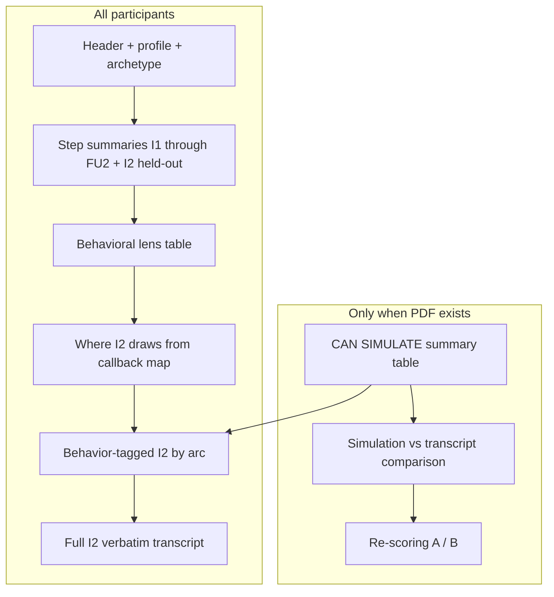

# Twin documents for other participants

Plan to scale from **Eliza Twin** (full calibration + simulation) and **Cath Twin** (calibration only) to the remaining **15 participants**.

---

## 1. Current state

| Participant | Phase | Cohort | I2 substantive turns | Twin doc | Simulation PDF |
|-------------|-------|--------|----------------------|----------|----------------|
| Eliza | 1 | A · Student | ~105 | Done (full) | Yes |
| Cath | 1 | C · Homeowner | 69 | Done (no sim) | No |
| Isabella | 1 | A · Student | ~94 | — | No |
| Ella | 1 | B · Env systems | ~132 | Done (no sim) | No |
| Jacob | 1 | A · Student | ~91 | — | No |
| Marina | 1 | C · Homeowner | ~37 | — | No |
| Stephen | 1 | B · Env systems | ~76 | — | No |
| Josie | 1 | B · Env systems | ~63 | — | No |
| Francesca | 2 | — | TBD | — | No |
| Amy | 2 | — | TBD | — | No |
| Gemma | 2 | — | TBD | — | No |
| Laura | 2 | — | TBD | — | No |
| Hannah | 2 | — | TBD | — | No |
| Naomi | 3 | — | TBD | — | No |
| Sophia | 3 | — | TBD | — | No |
| Katie | 3 | — | TBD | — | No |
| John | 3 | — | TBD | — | No |

**Already in repo:**

- Step summaries: `P0_PARTICIPANT_SUMMARIES.md` + `sections/<name>.md`
- Extracted text: `.extracted/<name>/` (all 17 participants)
- Extraction/classification: `scripts/classify_p0_files.py`
- Cath generator (participant-specific): `scripts/build_cath_twin.py`

---

## 2. Target document structure (two variants)



**Default for all new twins:** base sections only (Cath model).

**Add simulation block only when:** a participant-specific simulation PDF exists (currently Eliza only).

**CAN SIMULATE table:** include for all twins once turns are curated in arc tables (Cath: 8 turns).

---

## 3. Generalize the build pipeline

Refactor `build_cath_twin.py` into a shared system:

```
scripts/
  twin/
    build_twin.py          # CLI: python3 scripts/twin/build_twin.py Marina
    parse_transcript.py    # A:/B: parsing, substantive-turn filter
    classify_turn.py       # Heuristic B/F/P/C/R (starting point only)
    extract_all.py         # textutil batch → .extracted/<name>/
  twin_config/
    eliza.yaml
    cath.yaml
    isabella.yaml
    ...
```

**Each participant config holds:**

- `household_path`, `i2_docx`, `diary_docx[]`
- `p0_section`: line range or anchor in `P0_PARTICIPANT_SUMMARIES.md`
- `archetype`, `cohort`, `profile_one_liner`
- `pattern_library`: participant-specific IDs (not Eliza/Cath patterns)
- `turn_meta`, `turn_paraphrase`, `arc_turns` (curated JSON/YAML)
- `include_simulation: false` (+ `simulation_pdf` if ever added)

**Generator outputs:**

1. Skeleton from P0 + diary enrichment (automated)
2. Arc tables + transcript from config (semi-automated)
3. Empty CAN SIMULATE header stub (fill in manually after tagging arc tables)

---

## 4. Per-participant workflow (repeatable)

### Phase A — Extract and scaffold (automated, ~5 min each)

1. Confirm `.extracted/<name>/` has I2 + D1–D4 (+ D5 if Stephen/Amy/Katie)
2. Count substantive A turns (threshold: len ≥ 15, same as Cath/Eliza)
3. Run scaffold generator:
   - Copy step summaries from `sections/<name>.md`
   - Enrich thin diary bullets from diary txt (meals, packaging, disposal)
   - Pull I2 held-out themes + diary callbacks from P0
   - Emit behavioral lens table from P0
   - Append verbatim I2 transcript with turn numbers

### Phase B — Pattern library (human, ~30–45 min each)

Define **8–12 repeatable behavior patterns** from I1 + diaries + FU1/FU2, using cohort as a starting template:

| Cohort | Seed patterns (customize per person) |
|--------|--------------------------------------|
| **A · Student** | `identity_solo`, `culture_home_uk`, `budget_student`, `convenience_default`, `recycling_selective`, `occasion_campus`, `attgap_plastic`, `foodwaste_chain` |
| **B · Env systems** | `identity_systems`, `professional_lens`, `community_infra`, `recycling_diligence`, `attgap_plastic`, `meal_plan`, `freezing_chain`, `convenience_default` |
| **C · Homeowner** | `identity_green`, `recycling_high`, `reuse_habit`, `meal_plan`, `pricing_split`, `occasion_travel`, `attgap_plastic`, `foodwaste_chain` |

Rename/customize per participant (e.g. Marina: `refill_shopping`, `carfree_mobility`, `custody_split`; Josie: `waste_sector_pro`, `scrunch_test`, `kitchen_bins`).

### Phase C — Arc grouping + turn tagging (human, scales with I2 length)

| I2 size | Est. arcs | Est. curation time |
|---------|-----------|-------------------|
| ~35–70 (Marina, Cath, Josie, Stephen) | 7–10 | 2–3 hrs |
| ~90–105 (Isabella, Jacob, Eliza) | 10–14 | 3–5 hrs |
| ~130+ (Ella) | 14–18 | 5–7 hrs |

For each substantive turn:

1. Write a **paraphrased question** (standalone, not truncated verbatim)
2. Assign **type** (B/F/P/C/R)
3. Tag **behavioral patterns** (not fact recall)
4. Group into **conversational arcs** (8–10 themes from P0 I2 section)
5. Mark weak turns (comfort breaks, pure date recall, photo ID without pattern)

Use P0 **I2 diary callbacks** and **Interview 2 (held out) themes** as arc anchors.

### Phase D — Callback map (human, ~45–60 min each)

Expand P0's I2 callback bullets into Eliza/Cath-style sections:

- Earlier material table (I1, D1–D4, FU1, FU2, home visit if any)
- Explicit vs implicit look-back
- Topics mostly standalone in I2
- By I2 theme
- Short memory-weighting summary

Source: read I2 transcript + prior step summaries; P0 already lists most callbacks per participant.

### Phase E — CAN SIMULATE curation (human, ~30 min each)

1. Generate arc tables with all turns untagged
2. Review turns marked B or R+B that probe **decision logic**, not episodic recall
3. Tag **CAN SIMULATE** in arc tables and full transcript (expect ~5–15 turns per participant; Cath has 8)
4. Fill the header summary table manually from tagged rows

### Phase F — QA (checklist, ~15 min each)

- [ ] Substantive turn count matches extracted I2
- [ ] Every P0 I2 diary callback in callback map + tagged in an arc
- [ ] Participant patterns only (no cross-participant leakage)
- [ ] Paraphrases ≠ truncated verbatim
- [ ] Arc table turn # / paraphrase / verbatim align
- [ ] Full transcript turn labels match arc tables
- [ ] No simulation sections unless PDF exists
- [ ] CAN SIMULATE header table matches arc tags

---

## 5. Recommended rollout order

### Wave 1 — Phase 1 pilot (same study design as Eliza/Cath)

Do cohort representatives first to validate pattern templates:

1. **Marina** (C cohort, smallest I2 at ~37 turns — fast validation)
2. **Isabella** (A cohort, ~94 turns — shared-house recycling blocked)
3. **Josie** (B cohort, ~63 turns — waste-sector professional)
4. **Jacob**, **Ella**, **Stephen** (fill out A/B)

### Wave 2 — Phase 2 Confirm (Francesca, Amy, Gemma, Laura, Hannah)

Same workflow; confirm diary count (Amy may have 5 diaries) and I2 file naming from `classify_p0_files.py`.

### Wave 3 — Phase 3 Extend (Naomi, Sophia, Katie, John)

Same structure; check for phase-specific step differences in P0.

---

## 6. What to automate vs keep human

| Step | Automate | Human |
|------|----------|-------|
| textutil extraction | Yes | — |
| Step summaries from P0 | Copy | Diary enrichment review |
| Verbatim I2 transcript | Yes | Spot-check redactions |
| Heuristic turn type (B/F/P/C/R) | Draft | Final assignment |
| Paraphrased questions | — | All 69–132 per participant |
| Arc grouping | — | All |
| Pattern library | Cohort template | Customize per person |
| Callback map | P0 bullets as seed | Expand with I2 read-through |
| CAN SIMULATE | Empty header stub | Tag in arc tables + fill header manually |
| Simulation comparison | — | Only when PDF exists |

**Do not try to auto-tag behavioral patterns** — Eliza and Cath both required agent/human curation.

---

## 7. File organization

```
UK Environment Dataset/
  Eliza Twin.md              # reference (full)
  Cath Twin.md               # reference (no sim)
  <Name> Twin.md             # one per participant
  twins/                     # optional: curated configs
    marina/
      turn_meta.json
      arcs.json
      pattern_library.json
  .extracted/<name>/         # already exists
  scripts/twin/build_twin.py
```

Keep twin markdown at repo root (matches Eliza/Cath) unless you prefer a `twins/` folder later.

---

## 8. Effort estimate

| Wave | Participants | Est. time each | Total |
|------|-------------|----------------|-------|
| Wave 1 (Phase 1) | 6 | 4–6 hrs (Marina ~2 hrs) | ~25–30 hrs |
| Wave 2 (Phase 2) | 5 | 4–6 hrs | ~20–25 hrs |
| Wave 3 (Phase 3) | 4 | 4–6 hrs | ~16–20 hrs |
| Pipeline refactor | 1 | 4–6 hrs | ~5 hrs |

**Total: ~65–80 hrs** for all 15 remaining twins, or **~25–30 hrs** for Phase 1 only.

---

## 9. Immediate next steps

1. **Refactor** `build_cath_twin.py` → generic `build_twin.py` + `twins/cath/` config (extract hardcoded TURN_META/ARC_TURNS)
2. **Pilot on Marina** (~37 turns, smallest I2) to validate the generalized pipeline end-to-end
3. **Document cohort pattern templates** in `twins/README.md` (A/B/C seed libraries)
4. **Batch Wave 1** using Marina → Isabella → Josie order
5. **Defer simulation blocks** until participant PDFs exist; keep CAN SIMULATE curation in all twins for future scoring

---

## 10. Out of scope (unless requested later)

- Changes to `P0_PARTICIPANT_SUMMARIES.md` or `sections/*.md` (unless diary enrichment finds errors)
- Cross-participant merged twins or cohort simulation docs
- Automated re-scoring (Eliza-only for now)
- Phase 2/3 cohort assignment (not yet in P0 index like Phase 1)

---

## Reference documents

| Doc | Role |
|-----|------|
| `Eliza Twin.md` | Full template (includes simulation + re-scoring) |
| `Cath Twin.md` | Default template for new twins (no simulation) |
| `P0_PARTICIPANT_SUMMARIES.md` | Step summaries, I2 themes, diary callbacks |
| `sections/<name>.md` | Per-participant section source |
| `scripts/build_cath_twin.py` | Current generator to generalize |
